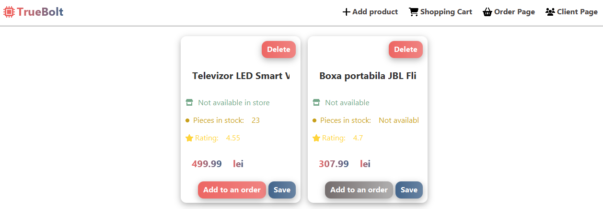
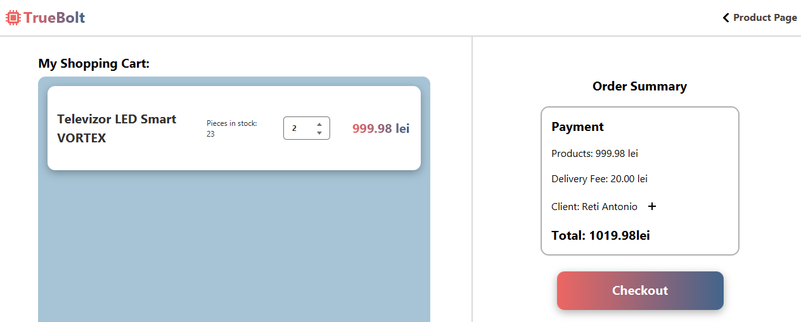
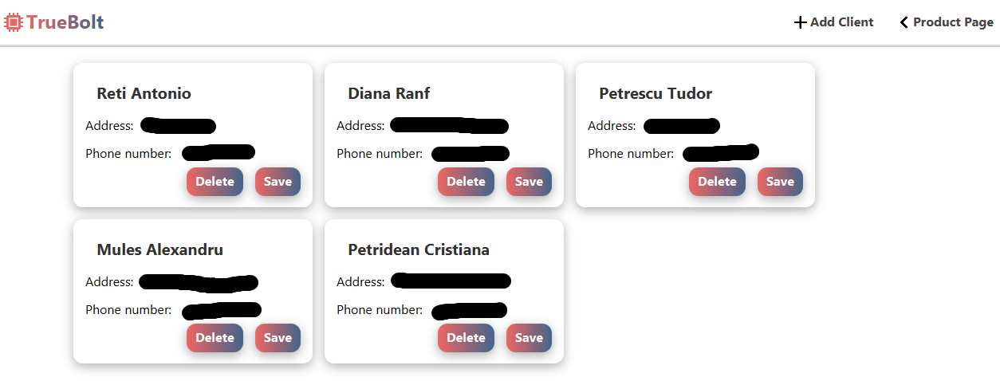
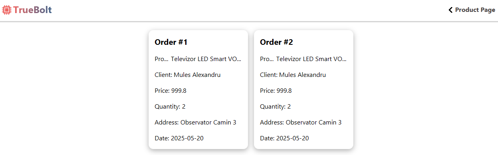

<h1>Order Management App developed with Java, JavaFX and Relational Database Integration</h1> 
Developed a full-stack order management application with Java back-end, JavaFX front-end (designed in Figma), and relational database integration, utilizing reflection techniques for
dynamic data storage and retrieval. Implemented efficient data models, optimized database
interactions, and designed an interactive UI to support order and client tracking and
management.

<h2>App Design / Screenshots</h2>

Designed using Figma.

<h3>Main Menu</h3>

<h3>Order Menu</h3>

<h3>Clients Management Menu (Censored)</h3>

<h3>Order History Menu</h3>

